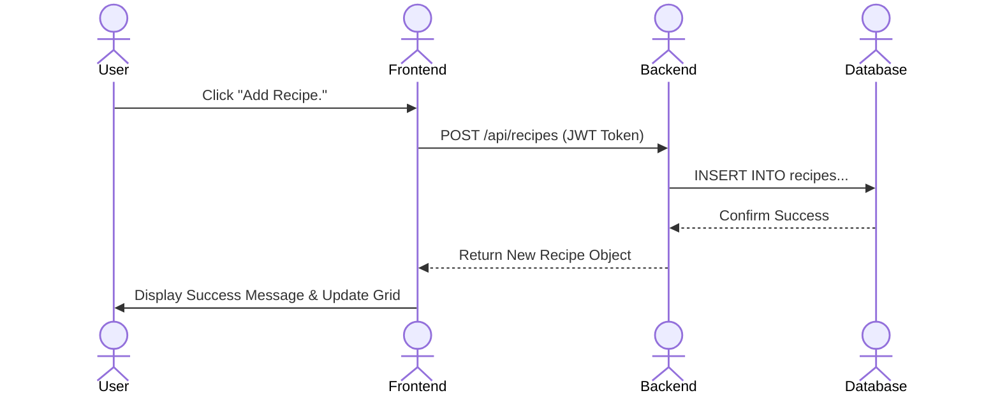

# Recipe Master

[My Notes](notes.md)

Recipe Master is a robust, full-stack web application designed for home chefs who want to digitize their culinary secrets. Unlike simple note-taking apps, Recipe Master provides a structured database for ingredients and instructions, allowing for precise editing and management. With real-time updates and seamless synchronization, users can manage their pantry and cookbook from any device, ensuring their favorite meals are always just a click away.

## 🚀 Specification Deliverable

For this deliverable, I did the following. I checked the box `[x]` and added a description for things I completed.

* [x] Proper use of Markdown
* [x] A concise and compelling elevator pitch
* [x] Description of key features
* [x] Description of how you will use each technology
* [x] One or more rough sketches of your application. Images must be embedded in this file using Markdown image references.

### Elevator pitch

In a world of cluttered bookmarks and lost index cards, **Recipe Master** is the ultimate digital sous-chef for the modern kitchen. It’s a streamlined, high-performance platform that lets you store, edit, and organize your personal recipe collection with the precision of a professional database. Whether you're adjusting ingredients on the fly or scaling a meal for guests, Recipe Master keeps your culinary data synchronized in real-time. It’s not just a digital cookbook; it’s a powerful management suite that ensures you never lose a "secret ingredient" again.

### Design

#### 🖥️ Main User Interface
| Public Home Page | Authenticated Dashboard |
| --- | --- |
|  |  |

#### 📝 Recipe Management
| Edit Recipe | View Recipe Details |
| --- | --- |
|  |  |

| Delete Recipe Popup | Add Recipe Page |
| --- | --- |
|  |  |

#### 👤 User Profile & Settings
| Profile Page | Edit Profile |
| --- | --- |
|  |  |

#### 🔐 Security & Navigation
| Change Password | Top Navigation Menu |
| --- | --- |
|  |  |

The application features a responsive dashboard where recipes are displayed in a clean grid. Users can quickly search through their collection, view detailed ingredient lists, and jump into an intuitive edit mode to refine their instructions.

### Key features

* **User Authentication**: Secure login and registration system using JWT and HTTP-only cookies to protect personal recipe data.
* **CRUD Recipe Management**: Full capability to Create, Read, Update, and Delete recipes and specific ingredients within those recipes.
* **Dynamic Search & Filtering**: Real-time filtering of the recipe library via a search bar to find specific meals instantly.
* **Relational Ingredient Tracking**: A structured database approach where ingredients are linked to recipes, allowing for precise quantity and unit management.
* **Real-time Activity Feed**: A live notification system that alerts the user (or group members) when a recipe is updated or a new one is added.

### Technologies

I am going to use the required technologies in the following ways.

* **HTML** - I will use semantic HTML5 elements (header, footer, main, section) to provide a structural foundation for the React components and ensure accessibility.
* **CSS** - I will implement a responsive design using Material UI components, including a theme toggle for light and dark modes.
* **React** - The frontend will be a Single Page Application (SPA). I will use functional components, Hooks (`useState`, `useEffect`), and React Router for seamless navigation between the Dashboard and Recipe detail pages.
* **Service** - I will build a Node.js/Express backend  with the following endpoints:
    * **Auth**: `POST /api/auth/register`, `POST /api/auth/login`, `POST /api/auth/logout`.
    * **User**: `GET /api/users/`, `PUT /api/users/email`, `PUT /api/users/username`, `DELETE /api/users/`.
    * **Recipes**: `GET /api/recipes/dashboard`, `POST /api/recipes/`, `PUT /api/recipes/`, `DELETE /api/recipes/`.
    * **Ingredients**: `GET /api/recipes/ingredients`, `POST /api/recipes/ingredient`, `PUT /api/recipes/ingredient`.
    * **3rd Party API**: I will call an image generation API to generate representative food and or ingredient images for each recipe/ingredient created by the user.
* **DB/Login** - I will use a MySQL or MongoDB database to store user credentials (hashed with bcrypt), recipe metadata, and ingredient lists. I will implement JWT-based authentication to secure private routes.
* **WebSocket** - I will use WebSockets (Socket.io) to broadcast real-time updates. When a recipe is added or modified, a notification will be pushed to the UI, allowing for a collaborative or multi-device "live" experience.

---

## 🚀 AWS deliverable

For this deliverable, I did the following. I checked the box `[x]` and added a description for things I completed.

- [x] **Server deployed and accessible with custom domain name** - [My server link](https://recipemaster.click/).

## 🚀 HTML deliverable

For this deliverable, I did the following. I checked the box `[x]` and added a description for things I completed.

* [x] **HTML pages** - I built the index.html file with a complete structure to serve as the application entry point.
* [x] **Proper HTML element usage** - I implemented semantic tags like header, nav, and section to follow modern accessibility standards.
* [x] **Links** - I added navigation anchors in the header and a footer link to the project's GitHub repository.
* [x] **Text** - I wrote original copy for the marketing sections and the step-by-step user instructions.
* [x] **3rd party API placeholder** - I connected the project to Google Fonts and Unsplash to demonstrate external asset integration, noting that the hero background image below the title could be swapped for a random image API in the future
* [x] **Images** - I incorporated a high-resolution background image for the hero section to improve UI appeal.
* [x] **Login placeholder** - I added dedicated buttons for signing in and account creation in the header and CTA sections.
* [x] **DB data placeholder** - I designed feature cards that act as visual containers for future database-driven recipe content.
* [x] **WebSocket placeholder** - I created a sharing section to represent where real-time social notifications will be handled.

## 🚀 CSS deliverable

For this deliverable, I did the following. I checked the box `[x]` and added a description for things I completed.

* [x] **Header, footer, and main content body** - I applied a cohesive dark theme with a vibrant gradient header and a distinct, centered footer to frame the content.
* [x] **Navigation elements** - I styled the nav links using flexbox and added opacity transitions to provide clear visual feedback during user interaction.
* [x] **Responsive to window resizing** - I implemented media queries to collapse grid columns and adjust font sizes, ensuring the layout remains functional on mobile devices.
* [x] **Application elements** - I used CSS Grid to create modular, interactive feature cards and a structured "How It Works" section with consistent spacing.
* [x] **Application text content** - I integrated the Poppins font family with specific weights and sizes to establish a professional visual hierarchy.
* [x] **Application images** - I styled the hero background with an overlay and cover positioning to maintain text readability and a polished look.

## 🚀 React part 1: Routing deliverable

For this deliverable, I did the following. I checked the box `[x]` and added a description for things I completed.

* [x] **Bundled using Vite** - I migrated the project to use Vite for bundling, which required restructuring the root directory and updating dependency configurations for a faster development environment.
* [x] **Components** - I converted all previous HTML pages into modular React components (e.g., `LandingPage`, `RecipeCard`, `NavigationBar`), separating layout, styles, and logic, and most pages require a valid user to be logged in for security reasons.
* [x] **Router** - I implemented `react-router-dom` to manage navigation between the Landing, Login, Dashboard, and Recipe pages without triggering full page reloads.

## 🚀 React part 2: Reactivity deliverable

For this deliverable, I did the following. I checked the box `[x]` and added a description for things I completed.

* [x] **All functionality implemented or mocked out** - I fully mocked the backend using `localStorage` for data persistence (users, recipes, etc) and `setInterval` for real-time WebSocket notifications across 11 different pages.
* [x] **Hooks** - I utilized `useState` to manage local component state (like form inputs and recipe data) and `useEffect` to handle side effects such as checking authentication status on page load.

## 🚀 Service deliverable

For this deliverable, I did the following. I checked the box `[x]` and added a description for things I completed.

- [x] **Node.js/Express HTTP service** - Created complete Express server in `service/index.js` running on port 4000 with proper middleware configuration and routing.
- [x] **Static middleware for frontend** - Implemented `app.use(express.static('public'))` to serve built React application from the `service/public/` directory in production.
- [x] **Calls to third-party endpoints** - Integrated `api.quotable.kurokeita.dev` to fetch random inspirational quotes displayed in a purple gradient box on the dashboard.
- [x] **Backend service endpoints** - Created RESTful endpoints for authentication (`/api/auth/*`), user profile (`/api/profile`), recipes (`/api/recipes`), and ingredients (`/api/ingredients`).
- [x] **Frontend calls service endpoints** - Updated 11 pages/components to replace localStorage with fetch calls using `credentials: 'include'` for cookie-based authentication.
- [x] **Supports registration, login, logout, and restricted endpoint** - Implemented full authentication flow with registration, login (sets HTTP-only cookie), logout (clears cookie), and middleware protecting all recipe/profile endpoints.
- [x] **Uses BCrypt to hash passwords** - All passwords hashed using BCrypt with salt rounds = 10 before storage; verification uses `bcrypt.compare()` to check credentials securely.

## 🚀 DB deliverable

- [x] **Stores data in MongoDB** - Migrated from in-memory storage to MongoDB Atlas. All recipes, ingredients, and user data now persist in MongoDB collections with proper indexing for performance.
- [x] **Stores credentials in MongoDB** - User credentials (email, hashed passwords, authentication tokens) are securely stored in MongoDB's `users` collection with bcrypt password hashing and unique email indexing.

## 🚀 WebSocket deliverable

For this deliverable, I did the following. I checked the box `[x]` and added a description for things I completed.

- [ ] **Backend listens for WebSocket connection** - I did not complete this part of the deliverable.
- [ ] **Frontend makes WebSocket connection** - I did not complete this part of the deliverable.
- [ ] **Data sent over WebSocket connection** - I did not complete this part of the deliverable.
- [ ] **WebSocket data displayed** - I did not complete this part of the deliverable.
- [ ] **Application is fully functional** - I did not complete this part of the deliverable.
