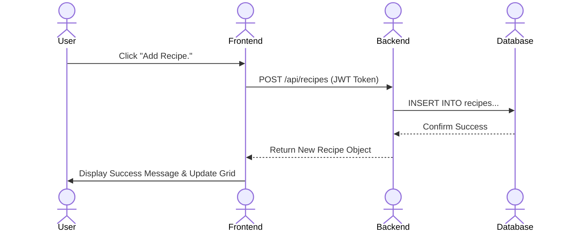

# Recipe Master

[My Notes](notes.md)

Recipe Master is a robust, full-stack web application designed for home chefs who want to digitize their culinary secrets. Unlike simple note-taking apps, Recipe Master provides a structured database for ingredients and instructions, allowing for precise editing and management. With real-time updates and seamless synchronization, users can manage their pantry and cookbook from any device, ensuring their favorite meals are always just a click away.

## 🚀 Specification Deliverable

For this deliverable, I did the following. I checked the box `[x]` and added a description for things I completed.

* [x] Proper use of Markdown
* [x] A concise and compelling elevator pitch
* [x] Description of key features
* [x] Description of how you will use each technology
* [x] One or more rough sketches of your application. Images must be embedded in this file using Markdown image references.

### Elevator pitch

In a world of cluttered bookmarks and lost index cards, **Recipe Master** is the ultimate digital sous-chef for the modern kitchen. It’s a streamlined, high-performance platform that lets you store, edit, and organize your personal recipe collection with the precision of a professional database. Whether you're adjusting ingredients on the fly or scaling a meal for guests, Recipe Master keeps your culinary data synchronized in real-time. It’s not just a digital cookbook; it’s a powerful management suite that ensures you never lose a "secret ingredient" again.

### Design

The application features a responsive dashboard where recipes are displayed in a clean grid. Users can quickly search through their collection, view detailed ingredient lists, and jump into an intuitive edit mode to refine their instructions.

### Key features

* **User Authentication**: Secure login and registration system using JWT and HTTP-only cookies to protect personal recipe data.
* **CRUD Recipe Management**: Full capability to Create, Read, Update, and Delete recipes and specific ingredients within those recipes.
* **Dynamic Search & Filtering**: Real-time filtering of the recipe library via a search bar to find specific meals instantly.
* **Relational Ingredient Tracking**: A structured database approach where ingredients are linked to recipes, allowing for precise quantity and unit management.
* **Real-time Activity Feed**: A live notification system that alerts the user (or group members) when a recipe is updated or a new one is added.

### Technologies

I am going to use the required technologies in the following ways.

* **HTML** - I will use semantic HTML5 elements (header, footer, main, section) to provide a structural foundation for the React components and ensure accessibility.
* **CSS** - I will implement a responsive design using Flexbox and Grid, including a theme toggle for light and dark modes, and CSS transitions for smooth UI interactions.
* **React** - The frontend will be a Single Page Application (SPA). I will use functional components, Hooks (`useState`, `useEffect`), and React Router for seamless navigation between the Dashboard and Recipe detail pages.
* **Service** - I will build a Node.js/Express backend with RESTful endpoints. It will include a call to a third-party image generation or search API to provide visual recipe and/or ingredient representations.
* **DB/Login** - I will use a MySQL or MongoDB database to store user credentials (hashed with bcrypt), recipe metadata, and ingredient lists. I will implement JWT-based authentication to secure private routes.
* **WebSocket** - I will use WebSockets (Socket.io) to broadcast real-time updates. When a recipe is added or modified, a notification will be pushed to the UI, allowing for a collaborative or multi-device "live" experience.

---

## 🚀 AWS deliverable

For this deliverable, I did the following. I checked the box `[x]` and added a description for things I completed.

- [ ] **Server deployed and accessible with custom domain name** - [My server link](https://yourdomainnamehere.click).

## 🚀 HTML deliverable

For this deliverable, I did the following. I checked the box `[x]` and added a description for things I completed.

- [ ] **HTML pages** - I did not complete this part of the deliverable.
- [ ] **Proper HTML element usage** - I did not complete this part of the deliverable.
- [ ] **Links** - I did not complete this part of the deliverable.
- [ ] **Text** - I did not complete this part of the deliverable.
- [ ] **3rd party API placeholder** - I did not complete this part of the deliverable.
- [ ] **Images** - I did not complete this part of the deliverable.
- [ ] **Login placeholder** - I did not complete this part of the deliverable.
- [ ] **DB data placeholder** - I did not complete this part of the deliverable.
- [ ] **WebSocket placeholder** - I did not complete this part of the deliverable.

## 🚀 CSS deliverable

For this deliverable, I did the following. I checked the box `[x]` and added a description for things I completed.

- [ ] **Header, footer, and main content body** - I did not complete this part of the deliverable.
- [ ] **Navigation elements** - I did not complete this part of the deliverable.
- [ ] **Responsive to window resizing** - I did not complete this part of the deliverable.
- [ ] **Application elements** - I did not complete this part of the deliverable.
- [ ] **Application text content** - I did not complete this part of the deliverable.
- [ ] **Application images** - I did not complete this part of the deliverable.

## 🚀 React part 1: Routing deliverable

For this deliverable, I did the following. I checked the box `[x]` and added a description for things I completed.

- [ ] **Bundled using Vite** - I did not complete this part of the deliverable.
- [ ] **Components** - I did not complete this part of the deliverable.
- [ ] **Router** - I did not complete this part of the deliverable.

## 🚀 React part 2: Reactivity deliverable

For this deliverable, I did the following. I checked the box `[x]` and added a description for things I completed.

- [ ] **All functionality implemented or mocked out** - I did not complete this part of the deliverable.
- [ ] **Hooks** - I did not complete this part of the deliverable.

## 🚀 Service deliverable

For this deliverable, I did the following. I checked the box `[x]` and added a description for things I completed.

- [ ] **Node.js/Express HTTP service** - I did not complete this part of the deliverable.
- [ ] **Static middleware for frontend** - I did not complete this part of the deliverable.
- [ ] **Calls to third-party endpoints** - I did not complete this part of the deliverable.
- [ ] **Backend service endpoints** - I did not complete this part of the deliverable.
- [ ] **Frontend calls service endpoints** - I did not complete this part of the deliverable.
- [ ] **Supports registration, login, logout, and restricted endpoint** - I did not complete this part of the deliverable.

## 🚀 DB deliverable

For this deliverable, I did the following. I checked the box `[x]` and added a description for things I completed.

- [ ] **Stores data in MongoDB** - I did not complete this part of the deliverable.
- [ ] **Stores credentials in MongoDB** - I did not complete this part of the deliverable.

## 🚀 WebSocket deliverable

For this deliverable, I did the following. I checked the box `[x]` and added a description for things I completed.

- [ ] **Backend listens for WebSocket connection** - I did not complete this part of the deliverable.
- [ ] **Frontend makes WebSocket connection** - I did not complete this part of the deliverable.
- [ ] **Data sent over WebSocket connection** - I did not complete this part of the deliverable.
- [ ] **WebSocket data displayed** - I did not complete this part of the deliverable.
- [ ] **Application is fully functional** - I did not complete this part of the deliverable.
